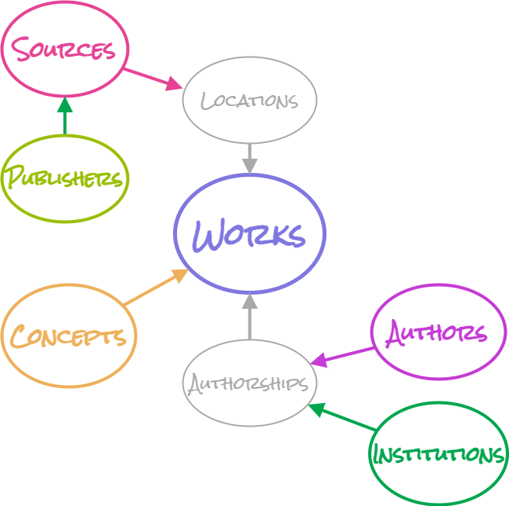

# Overview

OpenAlex is a fully open catalog of the global research system. It's named after the [ancient Library of Alexandria](https://en.wikipedia.org/wiki/Library\_of\_Alexandria) and made by the nonprofit [OurResearch](https://ourresearch.org/).

## Data

The OpenAlex dataset describes scholarly [_entities_ ](api-entities/entities-overview.md)and how those entities are connected to each other. Types of entities include [works](api-entities/works/), [authors](api-entities/authors/), [sources](api-entities/sources/), [institutions](api-entities/institutions/), [concepts](api-entities/concepts/), [publishers](api-entities/publishers/), and [funders](api-entities/funders/).

Together, these make a huge web (or more technically, heterogeneous directed [graph](https://en.wikipedia.org/wiki/Graph\_theory)) of hundreds of millions of entities and billions of connections between them all.

<figure><figcaption></figcaption></figure>

## Access

The API is the primary way to get OpenAlex data. It's free and requires no authentication. For best performance, [add your email](how-to-use-the-api/rate-limits-and-authentication.md#the-polite-pool) to all API requests, like `mailto=example@domain.com`. [Learn more](how-to-use-the-api/api-overview.md)

If you're looking for a visual interface, you can also check out the free [VOSviewer](https://www.vosviewer.com/), which lets you make network visualizations based on OpenAlex data:

.png>)

## Contact

For tech support and bug reports, please visit our [help page](https://openalex.org/help). You can follow us on Twitter at [@OpenAlex\_org](https://twitter.com/openalex\_org).

## Citation

If you use OpenAlex in research, please cite [this paper](https://arxiv.org/abs/2205.01833):&#x20;

> Priem, J., Piwowar, H., & Orr, R. (2022). _OpenAlex: A fully-open index of scholarly works, authors, venues, institutions, and concepts_. ArXiv. https://arxiv.org/abs/2205.01833
