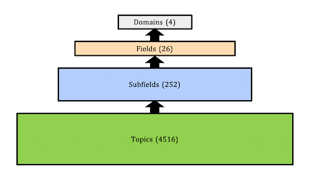

# 💡 Topics

Works in OpenAlex are tagged with Topics using an automated system that takes into account the available information about the work, including title, abstract, source (journal) name, and citations.

There are around 4,500 Topics. Topics are grouped into subfields, which are grouped into fields, which are grouped into top-level domains. This is shown in the diagram below, along with the counts for each.

<figure><figcaption></figcaption></figure>

Works are assigned topics using a model that assigns scores for each topic for a work. The highest-scoring topic is that work's [`primary_topic`](../works/work-object/README.md#primary_topic). Each topic has one subfield, one field, and one domain, so each of these may also be used to classify the work, depending on the level of granularity you want. We also provide additional highly ranked topics for works, in [`Work.topics`](../works/work-object/README.md#topics).

To learn more about how OpenAlex topics work in general, see [the Topics page at OpenAlex help pages](https://help.openalex.org/how-it-works/topics).

For a detailed description of the methods behind OpenAlex Topics, see our paper: ["OpenAlex: End-to-End Process for Topic Classification"](https://docs.google.com/document/d/1bDopkhuGieQ4F8gGNj7sEc8WSE8mvLZS/edit?usp=sharing&ouid=106329373929967149989&rtpof=true&sd=true). The code and model are available at [https://github.com/ourresearch/openalex-topic-classification](https://github.com/ourresearch/openalex-topic-classification).
