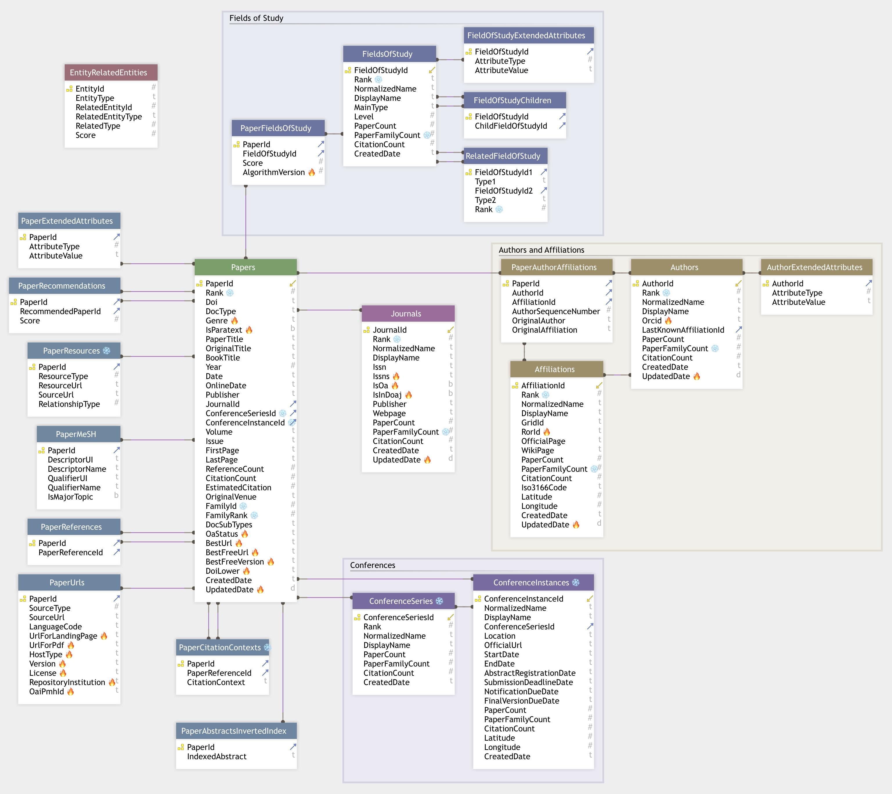

# MAG format schema

If you're migrating to OpenAlex from MAG, you'll want to check out the [MAG migration guide](https://openalex.org/mag-migration-guide) for more info.

You may also want to pay particular attention to tables and columns marked [📦️ARCHIVAL](https://openalex.org/mag-migration-guide#data-changes-archival) (not updated after Jan 3) and [🔥NEW](https://openalex.org/mag-migration-guide#data-changes-archival) (in OpenAlex, but not MAG).

## 

## Tables&#x20;

Affiliations&#x20;

AuthorExtendedAttributes&#x20;

Authors&#x20;

ConferenceInstances&#x20;

ConferenceSeries&#x20;

EntityRelatedEntities&#x20;

FieldOfStudyChildren&#x20;

FieldOfStudyExtendedAttributes&#x20;

FieldsOfStudy&#x20;

Journals&#x20;

PaperAbstractsInvertedIndex&#x20;

PaperAuthorAffiliations&#x20;

PaperCitationContexts&#x20;

PaperExtendedAttributes&#x20;

PaperFieldsOfStudy&#x20;

PaperMeSH&#x20;

PaperRecommendations&#x20;

PaperReferences&#x20;

PaperResources Papers&#x20;

PaperUrls&#x20;

RelatedFieldOfStudy

## Affiliations

Base table for affiliations/institutions (mag/Affiliations.txt)

| Field Name       | Data Type | Description                                                                 |
| ---------------- | --------- | --------------------------------------------------------------------------- |
| AffiliationId    | bigint    | PRIMARY KEY                                                                 |
| Rank             | integer   | ARCHIVAL; no new ranks will be added after Jan 3.                           |
| NormalizedName   | varchar   | UPDATED; slightly different normalization algorithm                         |
| DisplayName      | varchar   |                                                                             |
| GridId           | varchar   | ARCHIVAL; RorId is the new standard identifier for organizations            |
| RorId            | varchar   | NEW; ROR for this organization, see https://ror.org, https://ror.org/:RorId |
| OfficialPage     | varchar   |                                                                             |
| WikiPage         | varchar   |                                                                             |
| PaperCount       | bigint    |                                                                             |
| PaperFamilyCount | bigint    | ARCHIVAL; same value as PaperCount after Jan 3                              |
| CitationCount    | bigint    |                                                                             |
| Iso3166Code      | varchar   | Two-letter country codes, see https://en.wikipedia.org/wiki/ISO\_3166-2     |
| Latitude         | real      |                                                                             |
| Longitude        | real      |                                                                             |
| CreatedDate      | varchar   |                                                                             |
| UpdatedDate      | timestamp | NEW; set values updated from new ror data                                   |

## AuthorExtendedAttributes&#x20;

Additional author name representations (mag/AuthorExtendedAttributes.txt)

## Authors&#x20;

Base table for authors (mag/Authors.txt)

